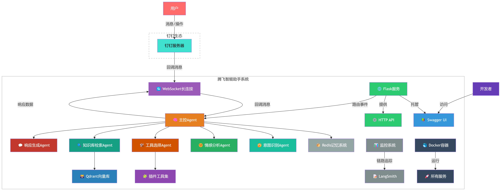
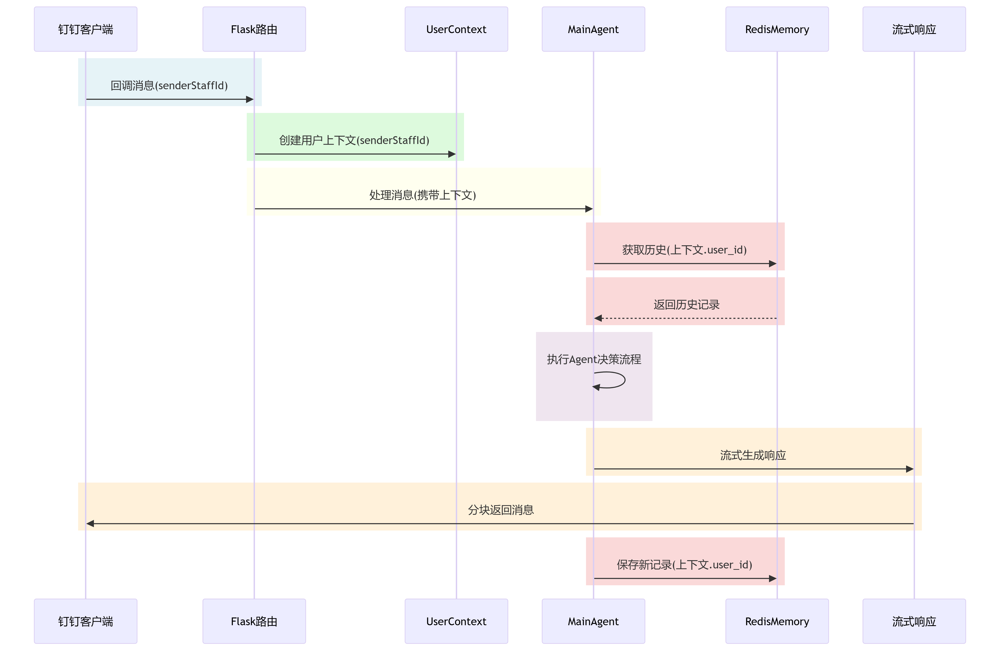
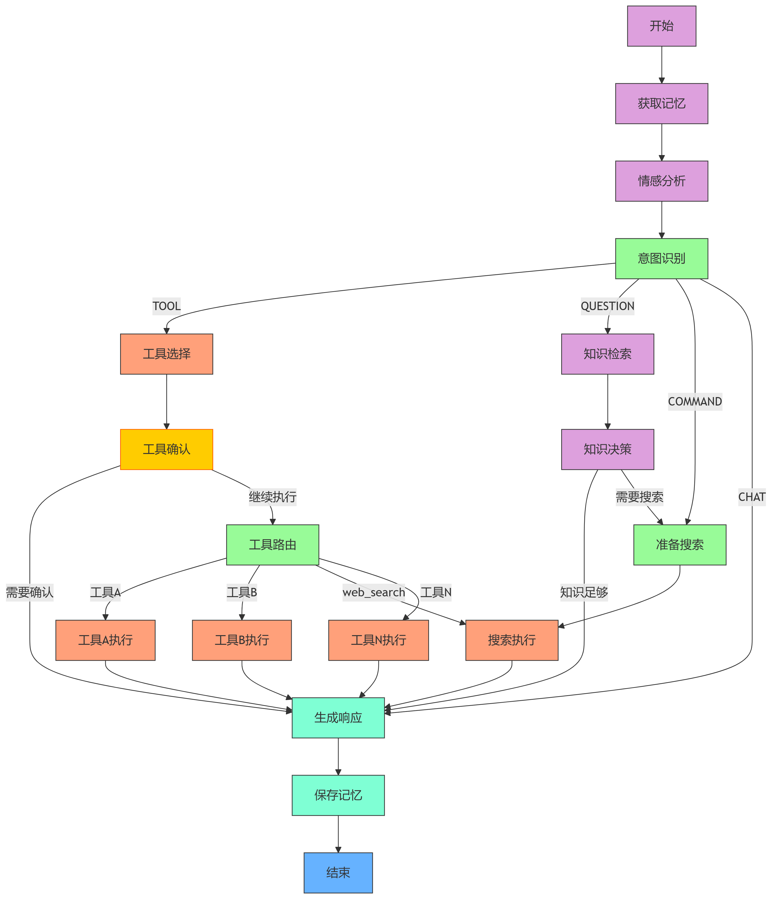
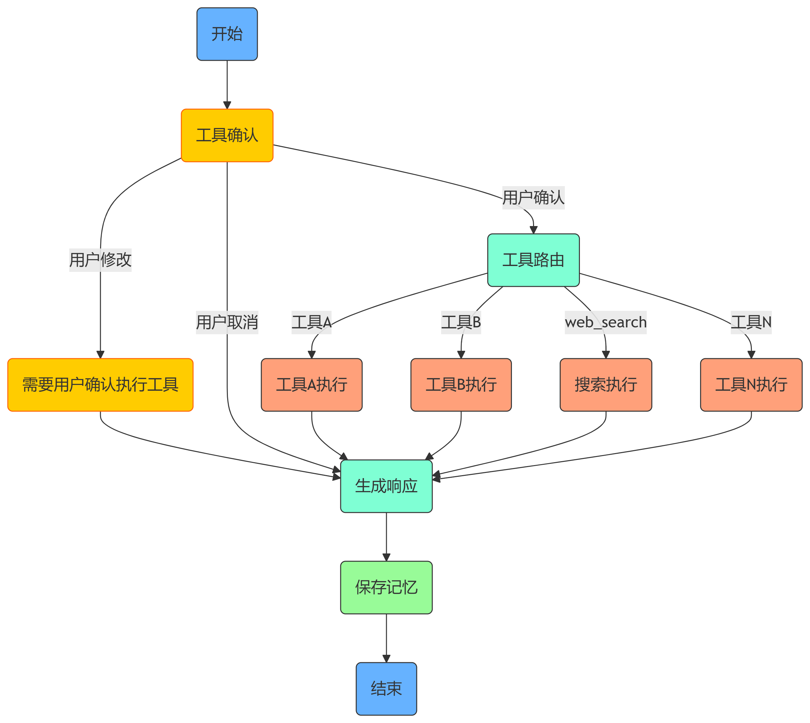

# flyoss-assistant

## 一、腾飞智能助手是什么

腾飞智能助手是基于钉钉平台的AI助手，集成了大型语言模型、知识库、对话记忆储存和多种工具能力，提供智能问答、任务处理和信息检索服务。深度集成钉钉构建智能待办/日程/日志/审批系统等，实现自然语言到API的自动转换，用户操作步骤减少70%。

**[获取视频教程](https://www.bilibili.com/video/BV1QPbxz2Erf/?spm_id_from=333.1387.homepage.video_card.click&vd_source=1d9ee27ad4b5ca336fdf6e9e4deaf1d9)** 

## 二、技术选型

### 开发框架

### AI 组件

### 数据库

### 一键部署

## 三、核心特性

1、💬 **智能对话**：基于 DeepSeek-V3 671B 大模型的自然语言理解与生成，支持多轮对话

2、🧠 **记忆系统**：Redis实现的用户对话历史记忆存储

3、📚 **知识库集成**：基于 BAAI/bge-m3 嵌入模型，Qdrant向量数据库支持的知识检索

4、😊 **情感分析**：实时用户情绪侦测

5、😍 **意图识别**：分析用户意图，触发工作流

6、🛠️ **工具执行**：基于 LangGraph 架构，支持多工具执行

7、🎏 **人工干预**：工具执行前进行人机交互，可通过人工干预

8、🚀 **RAG增强**：知识库和网络搜索结合，提升知识 recall

9、🔧 **插件系统**：可扩展工具框架，实现动态注册

10、📊 **可观测性**：LangSmith集成实现全链路监控

11、🐳 **容器化部署**：Docker一键部署

## 四、总体设计

### 1、系统架构

### 2、钉钉消息处理流程

### 3、Agent决策流程

### 4、工具执行确认决策流程

## 五、核心功能

### 1、情感分析

利用 DeepSeek-V3 大语言模型实时分析用户输入消息，根据情感分类指标进行分类（例如：happy、sad、angry、confused、neutral等），再根据情绪强度评分标准进行评分，并且提供分析依据和评分的标准，准确率高达 92%。

### 2、意图识别

利用 DeepSeek-V3 大语言模型实时分析用户输入消息，根据意图分类标准（例如：聊天、指令、问题、调用工具等），通过决策流程控制准备识别用户意图，并且提供识别用户意图的依据，准确率高达 95%。

### 3、驱动工作流

通过计情感分析和准确识别用户意图，动态驱动Agent工作流。

**聊天：** 据对用户情感分析，根据情感分类和评分提供智能调整语气机制，生成符合用户情绪、结合上下文信息（对话记忆）的自然对话响应。用户产生负面情绪时钉钉创建待办响应提升 300%，显著提升用户体验。

**指令：** 根据对用户意图识别（例如：天气、新闻、查找附近、翻译等），调用搜索工具进行实时查询，利用 DeepSeek-V3 大语言模型将实时查询数据、用户情绪、结合上下文信息（对话记忆）进行 RAG 增强的自然对话响应。

**问题：** 根据对用户意图识别（纯知识性问题例如：LangGraph快速入门、MySQL安装教程），先从知识库（Qdrant）进行相似度检索，如果检索到结果，则利用 DeepSeek-V3 大语言模型将将检索结果、用户情绪、结合上下文信息（对话记忆）进行 RAG 增强的自然对话响应；否则调用搜索工具进行实时查询，利用 DeepSeek-V3 大语言模型将实时查询数据、用户情绪、结合上下文信息（对话记忆）进行 RAG 增强的自然对话响应。

**调用工具：** 根据对用户意图识别（例如钉钉工具：待办、日程、日志、审批等），通过LLM指令解析实现待办/日程/日志/审批的自动化管理（支持15种语义场景），工具调用成功率达98.5%，减少用户操作路径50%以上。

### 4、知识库构建

使用本地上传和网页批量抓取的方式，并整合Qdrant（向量存储）来构建的知识库，利用DeepSeek大模型进行RAG增强问答，准确率提升至95%。

### 5、对话记忆存储

构建混合记忆架构，结合BGE-M3嵌入模型与Redis向量数据库，实现短期对话记忆（30天）与长期知识库（10万+条目）的协同检索，问答准确率提升至90%。

### 6、插件系统

可扩展工具框架，实现工具动态注册，构建工具节点动态图，实现工具高度复用，减低代码耦合度，提高系统可维护性和可扩展性。

### 7、人工干预

通过配置，工具调用前可进行人工干预，提供人机交互的用户确认机制，用户可确认、取消工具的调用，也可以对调用工具的参数进行调整后再确认是否调用。

### 8、可观测性

集成LangSmith实现全链路追踪，建立情感分析准确率、工具调用延迟、知识检索召回率等12项核心监控指标，推动系统迭代周期缩短40%。

### 9、容器化部署

基于Docker-Compose设计生产环境部署方案，优化GPU资源利用率（推理服务资源消耗降低35%），支持秒级弹性伸缩，系统可用性达99.95%。

## 创作不易，别忘了点亮Star，你们的支持，是我源源不断的动力。

## 欢迎加入交流群

- 微信公众号

- QQ技术交流群

